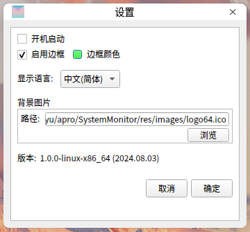
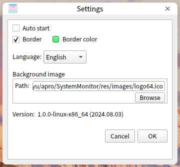

# encoding
UTF-8

# 描述
这是一个简洁的**Linux**系统监视器。具有监控网速（上下速度、下行速度）、CPU利用率、内存占用率的功能。
界面实现基于`Qt5.14.2`。

# clone
```bash
git clone https://github.com/JiuYu77/SystemMonitor.git
```

# 编译
## 确保已经安装了Qt
本项目基于`Qt5.14.2`搭建界面。

## 修改CMakeLists.txt
```bash
set(CMAKE_PREFIX_PATH "/home/jyu/install/Qt5.14.2/5.14.2/gcc_64")
修改为：
set(CMAKE_PREFIX_PATH "你的 Qt gcc目录")
```

## 创建build文件夹
```bash
mkdir build
cd build
```

## cmake
```bash
cmake ..
```

## make
```bash
make
```
# script

## language.sh
`language.sh`用于生成 .ts文件 和 .qm文件。

```bash
qt="/home/jyu/install/Qt5.14.2/5.14.2/gcc_64/"
修改为：
qt="你的 Qt gcc目录"
```

```bash
bash script/language.sh
```

## install.sh
`install.sh`设置了`SystemMonitor.desktop`。
```bash
# rm ~/.local/share/applications/SystemMonitor.desktop
bash script/install.sh
```
然后，你可以通过点击**图标**，来启动程序。

## uninstall.sh
`uninstall.sh`删除`SystemMonitor.desktop`。
```bash
bash script/uninstall.sh
```

# 运行截图







# 致谢
[ctguLMY/linux_terminal_monitor](https://github.com/ctguLMY/linux_terminal_monitor)

[nlohmann/json](https://github.com/nlohmann/json)
