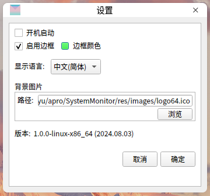
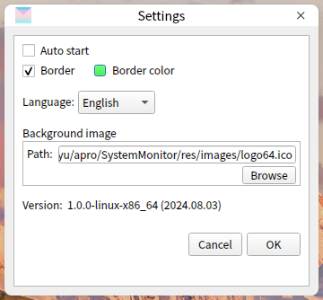

# encoding
UTF-8

# 描述
这是一个简洁的**Linux**系统监视器。具有监控网速（上下速度、下行速度）、CPU利用率、内存占用率的功能。
界面实现基于`Qt5.14.2`。

- 基于 Qt5 框架开发Linux平台系统监控应用，实时可视化 CPU/内存利用率、网络吞吐量 等核心指标。
- 通过解析 /proc/stat 和 /proc/meminfo 实现 高精度资源采集（采样周期1s）。
- 多线程分别计算更新利用率和网速。
- 利用C++和Qt实现界面和数据处理，使用json格式配置文件。
- 利用Qt信号槽机制实现程序退出、重置、实现修改背景、开机自启动、显示在最上层等功能。
- Qt鼠标事件，实现界面移动，并记录当前位置于json文件。

# clone
```bash
git clone https://github.com/JiuYu77/SystemMonitor.git
```

# 编译
## 确保已经安装了Qt
本项目基于`Qt5.14.2`搭建界面。

## 修改CMakeLists.txt
```bash
set(CMAKE_PREFIX_PATH "/home/jyu/install/Qt5.14.2/5.14.2/gcc_64")
修改为：
set(CMAKE_PREFIX_PATH "你的 Qt gcc目录")
```

## 创建build文件夹
```bash
mkdir build
cd build
```

## cmake
```bash
cmake ..
```

## make
```bash
make
```
# script

## cmd.sh
通过`cmd.sh`调用其他bash脚本。

```bash
qt=/home/jyu/install/Qt5.14.2/5.14.2/gcc_64
修改为：
qt="你的 Qt gcc目录"
```

```bash
bash cmd.sh --help
```

## language.sh
`language.sh`用于生成 .ts文件 和 .qm文件。

```bash
qt="/home/jyu/install/Qt5.14.2/5.14.2/gcc_64/"
修改为：
qt="你的 Qt gcc目录"
```

```bash
bash cmd.sh lang
```

## install.sh
`install.sh`设置了`SystemMonitor.desktop`。
```bash
# rm ~/.local/share/applications/SystemMonitor.desktop
bash cmd.sh install
```
然后，你可以通过点击**图标**，来启动程序。

## uninstall.sh
`uninstall.sh`删除`SystemMonitor.desktop`。
```bash
bash cmd.sh uninstall
```

# 运行截图







# 致谢
[ctguLMY/linux_terminal_monitor](https://github.com/ctguLMY/linux_terminal_monitor)

[nlohmann/json](https://github.com/nlohmann/json)
