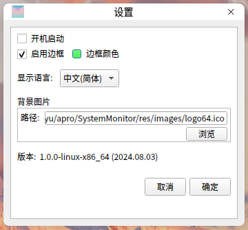
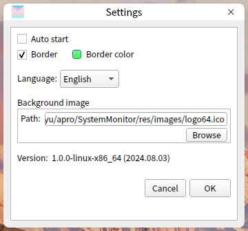

# encoding
UTF-8

# 描述
这是一个简洁的**Linux**系统监视器。具有监控网速（上下速度、下行速度）、CPU利用率、内存占用率的功能。
界面实现基于`Qt5.14.2`。


# script

## install.sh
`install.sh`设置了`SystemMonitor.desktop`。
```bash
# rm ~/.local/share/applications/SystemMonitor.desktop
bash script/install
```
然后，你可以通过点击**图标**，来启动程序。

## uninstall.sh
`uninstall.sh`删除`SystemMonitor.desktop`。
```bash
bash script/uninstall
```

# 运行截图







# 致谢
[ctguLMY/linux_terminal_monitor](https://github.com/ctguLMY/linux_terminal_monitor)

[nlohmann/json](https://github.com/nlohmann/json)
